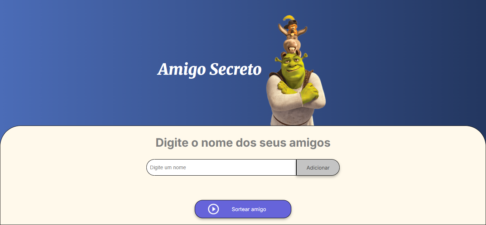

 

<h1 align="center"> Projeto em Javascript para sortear um amigo secreto </h1>

  Sistema desenvolvido para o programa <b> Alura NextGeneration</b> em parceria com a <b>Oracle</b>. 

  
  O Projeto foi desenvolver uma aplicação que permitisse ao usuário inserir nomes de amigos em uma lista para, em seguida, realizar um sorteio aleatório que determinasse o "amigo secreto".

# :wrench: Funcionalidades do projeto

- `Funcionalidade 1`: Inclusão do nome de amigos e incluí-los através do botão adicionar

 

  
- `Funcionalidade 2`: A lista dos nomes é mostrada na tela, com validação de nomes em branco ou repetidos.

  
- `Funcionalidade 3`: Após completar a lista, clicando em "Sortear amigo" será realizado o sorteio para definir o amigo secreto.

 

# 📁 Acesso ao projeto

Você pode baixar o projeto através [deste link](https://github.com/Ic0rc/proj-amigo-secreto/archive/refs/heads/main.zip)

# 🛠️ Abrir e rodar o projeto

Após baixar e descompactar, você entra na pasta:

>challenge-amigo-secreto_pt-main

Seleciona o arquivo:
>index.html

# :computer: Técnologias Utilizadas

- HTML
- JavaScript
- CSS

